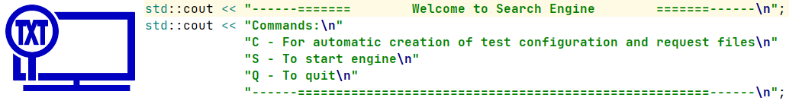
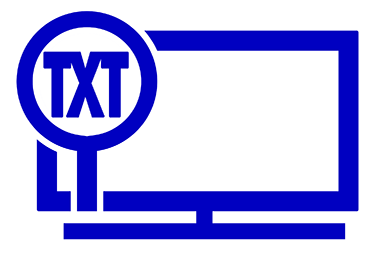

<h1 align="center"> Search Engine </h1>

<h5 align="center"> The "Search Engine" is the final project of the course "Developer in C++ from scratch" on the training platform <a href="https://go.skillbox.ru/"> "SkillBox"</a>. </h5>

---

### contents:
* [Пункт 1](#a1) 
* [Пункт 1](#a1)

[Home](#home)

# Заголовок 1
## Заголовок 2
### Заголовок 3
#### Заголовок 4
##### Заголовок 5
###### Заголовок 6

---

* Меню
    * подменю
        + подменю (целя точка)
        - подменю (Пустая точка)

___
           
1. Нумерованый список
    1. подпункт
    2. хм...
        1. ещё вложим
2. Второй

***
# Форматирование текста

* _Курсив_
* __Жирный__
* ___Жирный курсив___
* ***Так же со звёздочками***
* ~~зачёркнутый~~
* ___~~Комбинация жирный зачёркнутый курсив~~___

\# Экранированная решётка

Заголовок
: Текст

___

# Вставка кода

~~~
some code
~~~

~~~ C++
 std::cout << "------=======        Welcome to Search Engine        =======------\n";
 std::cout << "Commands:\n"
              "C - For automatic creation of test configuration and request files\n"
              "S - To start engine\n"
              "Q - To quit\n"
              "------======================================================------\n";
~~~

Строка с вложенным `codom = 1;`

---
# Ссылки

[Ссылка на проект](https://github.com/shurk4/SearchEngine)

[Полезная ссылка](https://github.com/shurk4/SearchEngine)

---

---

> ___Цитата___
>> Цитата
>>> Цитата

___

# Сноски

Сноска перваях[^1] Вторая[^2] - все сноски переносятся в конец страницы

[^1]: Текст сноски 1
[^2]: Текст сноски 2

***

# Таблицы

### положение символа ":" показывает позицию текста
столбец 1 | столбец 2 | столбец 3
:---------|:---------:|---------:
1 | 2 | 3 
4 | 5 | 6
7 | 8 |  

***

# Перемещение по странице:

<a id="anchor1">Якорь</a>
[На якорь](#anchor1)

[В начало](#anchor2)

---

# Смайлы

:white_check_mark:
[Поддерживаемые смайлы](https://github.com/GnuriaN/format-README/blob/master/emoji.md)

---

# Чекбоксы

- [X] чекбокс 1
- [ ] чекбокс 2

___

# Полезные ссылки:

[Видео по readme.md](https://www.youtube.com/watch?v=NXNf9aYTCZ0&t=661s)

[Шилды](https://shields.io/) - [смотреть видео](https://youtu.be/NXNf9aYTCZ0?t=1007)

